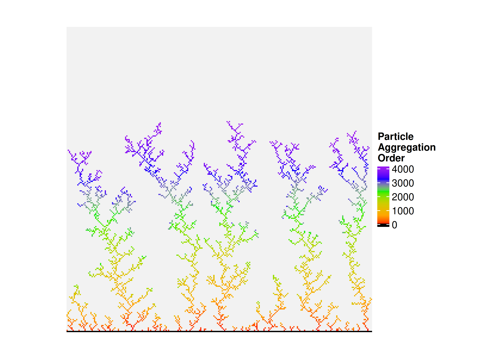

<!-- README.md is generated from README.Rmd. Please edit that file -->

# Diffusion-Limited Aggregation

The `DLA()` R function performs diffusion-limited aggregation (DLA) and
outputs an integer matrix.

[Link to DLA Wikipedia
page.](https://en.wikipedia.org/wiki/Diffusion-limited_aggregation)

The core is written in C++, so the `Rcpp` package is required and will
be installed automatically when DLA.R is sourced.

This is a work in progress, so the program may be slow with a large
number of particles.

## Usage

Below is an example of how the `DLA()` function is used. The output is
visualized with the `ComplexHeatmap` R package.

``` r
if (!require("BiocManager", quietly = TRUE, character.only = TRUE)) {
  install.packages("BiocManager", dependencies = TRUE)
}

if (!require("ComplexHeatmap", quietly = TRUE, character.only = TRUE)) {
  BiocManager::install("ComplexHeatmap")
}

library(ComplexHeatmap)
```

``` r
source("DLA.R")

# Dimensions of the output matrix
nr <- 2^8
nc <- 2^8

# The bottom row of the output matrix will be filled with particles to start
x <- seq_len(nc)
y <- rep.int(nr, length(x))
n_particles <- 2^12

res <- DLA(
  nr = nr,
  nc = nc,
  x = x,
  y = y,
  n_particles = n_particles,
  seed = 9001L
)

# Heatmap ----
particle_size <- unit(1.2, "pt")

Heatmap(
  matrix = res,
  col = circlize::colorRamp2(
    breaks = c(
      0L,
      1L,
      quantile(res, 1:4 / 5, na.rm = TRUE),
      max(res, na.rm = TRUE)
    ),
    colors = c("black", "red", "orange", "yellow3", "green2", "blue", "purple")
  ),
  na_col = "grey95",
  cluster_rows = FALSE,
  cluster_columns = FALSE,
  height = particle_size * nr,
  width = particle_size * nc,
  heatmap_legend_param = list(
    title = "Particle\nAggregation\nOrder"
  )
)
```

<!-- -->

### Session Information

``` r
print(sessionInfo(), locale = FALSE)
#> R version 4.3.3 (2024-02-29)
#> Platform: x86_64-pc-linux-gnu (64-bit)
#> Running under: Linux Mint 22.3
#> 
#> Matrix products: default
#> BLAS:   /usr/lib/x86_64-linux-gnu/blas/libblas.so.3.12.0 
#> LAPACK: /usr/lib/x86_64-linux-gnu/lapack/liblapack.so.3.12.0
#> 
#> attached base packages:
#> [1] grid      stats     graphics  grDevices utils     datasets  methods  
#> [8] base     
#> 
#> other attached packages:
#> [1] Rcpp_1.1.2            dqrng_0.4.1           ComplexHeatmap_2.18.0
#> [4] BiocManager_1.30.27  
#> 
#> loaded via a namespace (and not attached):
#>  [1] crayon_1.5.3        doParallel_1.0.17   cli_3.6.6          
#>  [4] knitr_1.51          rlang_1.3.0         xfun_0.60          
#>  [7] otel_0.2.0          circlize_0.4.18     png_0.1-9          
#> [10] clue_0.3-68         S4Vectors_0.40.2    rjson_0.2.23       
#> [13] colorspace_2.1-3    htmltools_0.5.9     GlobalOptions_0.1.4
#> [16] stats4_4.3.3        rmarkdown_2.31      evaluate_1.0.5     
#> [19] fastmap_1.2.0       yaml_2.3.12         foreach_1.5.2      
#> [22] IRanges_2.36.0      cluster_2.1.8.2     compiler_4.3.3     
#> [25] codetools_0.2-20    RColorBrewer_1.1-3  rstudioapi_0.19.0  
#> [28] digest_0.6.39       shape_1.4.6.1       parallel_4.3.3     
#> [31] GetoptLong_1.1.1    tools_4.3.3         iterators_1.0.14   
#> [34] matrixStats_1.5.0   BiocGenerics_0.48.1
```
